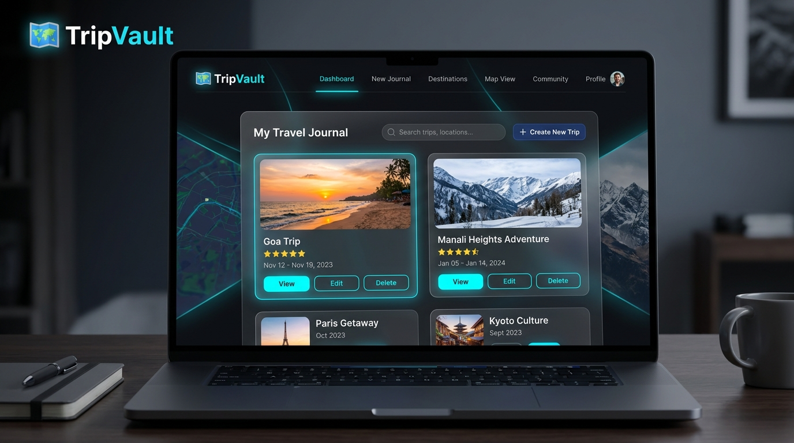
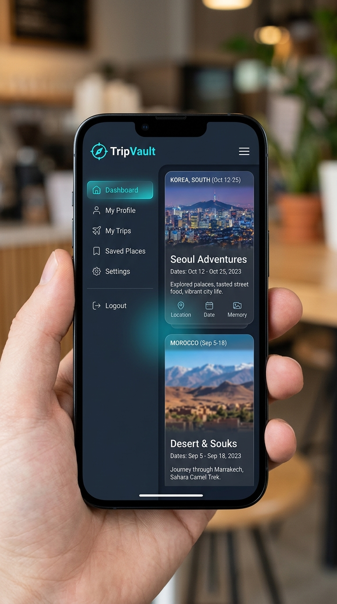

# 🗺️ TripVault

TripVault is a full-stack, production-ready MERN (MongoDB, Express.js, React, Node.js) web application built for travel memory enthusiasts. It empowers users to document their travel experiences with secure JWT authentication, full trip CRUD operations, Cloudinary-powered photo uploads, customizable traveler bios, and shareable public profile pages (`/profile/:username`).

---

## 🚀 Live Production Links

| Service | Environment | Live URL |
| :--- | :--- | :--- |
| **Frontend App** | Vercel (Production) | [https://trip-vault-olive.vercel.app](https://trip-vault-olive.vercel.app) |
| **Backend API** | Render (Production) | [https://tripvault-backend-wvx1.onrender.com](https://tripvault-backend-wvx1.onrender.com) |
| **API Health Check** | Render | [https://tripvault-backend-wvx1.onrender.com/health](https://tripvault-backend-wvx1.onrender.com/health) |

---

## 📸 Screenshots & Responsive Design

### Desktop Dashboard


### Mobile View (375px)


---

## 📊 Feature Matrix

| Feature | Description | Tech Used | Status |
| :--- | :--- | :--- | :--- |
| **JWT Authentication** | Secure signup, login, persistent session, and token validation | React Context, Node/Express, JWT, bcryptjs | ✅ Production Ready |
| **Trip Management (CRUD)** | Create, view, edit, and delete travel logs with ratings & dates | React 19, Express, MongoDB Atlas, Mongoose | ✅ Production Ready |
| **Cloud Photo Uploads** | Direct multipart image uploads for trip cover images | Multer, Cloudinary SDK, Express | ✅ Production Ready |
| **Public Traveler Profiles** | Shareable profile routes (`/profile/:username`) displaying public trips & bio | React Router v7, Express API | ✅ Production Ready |
| **Profile Customization** | Editable bio and custom unique username configuration | React Forms, Mongoose User Schema | ✅ Production Ready |
| **Toast Notifications** | Real-time feedback alerts for user actions | Custom React Toast Component | ✅ Production Ready |
| **Responsive Hamburger Menu**| Mobile-friendly navigation drawer for small screens (375px+) | CSS Flexbox/Grid, Glassmorphism | ✅ Production Ready |
| **SPA Single-Page Rewrites** | Direct URL access and browser refreshes without 404s | Vercel Rewrite Rules (`vercel.json`) | ✅ Production Ready |

---

## 🛠️ Tech Stack

### Frontend (`/client`)
- **React 19** - Component-based user interface architecture
- **Vite 5** - Ultra-fast development server and production bundler
- **React Router DOM v7** - Declarative client-side routing & protected routes
- **Axios** - Promise-based HTTP client with request interceptors for JWT
- **Vanilla CSS (Glassmorphism)** - Modern custom dark theme with flex/grid responsiveness

### Backend (`/server`)
- **Node.js** - Server runtime environment
- **Express.js** - REST API framework with modular controllers and routes
- **MongoDB Atlas & Mongoose** - Cloud NoSQL database with schema modeling
- **JSON Web Token (JWT) & bcryptjs** - Authentication token signing and password hashing
- **Multer & Cloudinary SDK** - Memory storage buffer handling and CDN image upload

### Infrastructure & Deployment
- **Vercel** - Production deployment for Vite SPA frontend
- **Render** - Production deployment for Express REST API backend
- **Cloudinary** - Media asset management & image delivery CDN

---

## ✨ Main Features Breakdown

1. 🔒 **User Authentication & Authorization**:
   - Secure registration and login flow.
   - JWT stored securely in `localStorage` and attached to API requests via Axios interceptors.
   - Server-side route protection ensuring users can only edit or delete their own trips.

2. 🧳 **Full Trip CRUD**:
   - **Create**: Add trip title, destination, dates, rating (1–5 stars), description, and cover photo.
   - **Read**: View trip list on Dashboard and inspect detailed view on dedicated trip page.
   - **Update**: Edit trip details and update cover photos dynamically.
   - **Delete**: Remove trip entries with confirmation safeguards.

3. 📷 **Cloudinary Photo Uploads**:
   - Upload cover photos for travel entries stored directly on Cloudinary CDN.
   - Client-side image validation (format & max 5MB size limit).

4. 👤 **Profile Customization & Public Shareable Profiles**:
   - Update bio and custom unique username.
   - Public profile route `/profile/:username` allows sharing travel adventures publicly without exposing private fields.

5. 🔔 **Interactive Toast Notifications**:
   - Real-time feedback toasts for login, registration, trip creation, trip editing, trip deletion, photo upload, and profile updates.

6. 📱 **Responsive Design & Mobile Navigation**:
   - Fully optimized for screens from 375px mobile to widescreen desktops.
   - Hamburger drawer menu for mobile navigation with backdrop blur effect.

7. ⏳ **Loading & Empty States**:
   - Smooth loading spinners during async operations.
   - Friendly empty state screen (`🌴 You haven't added any trips yet`) with a quick-action button.

---

## 📁 Repository Directory Structure

```text
TripVault/
├── client/
│   ├── src/
│   │   ├── components/
│   │   │   ├── Button.jsx
│   │   │   ├── Footer.jsx
│   │   │   ├── Input.jsx
│   │   │   ├── Loader.jsx
│   │   │   ├── Navbar.jsx
│   │   │   ├── ProtectedRoute.jsx
│   │   │   ├── Toast.jsx
│   │   │   └── TripCard.jsx
│   │   ├── context/
│   │   │   └── AuthContext.jsx
│   │   ├── pages/
│   │   │   ├── Dashboard.jsx
│   │   │   ├── Home.jsx
│   │   │   ├── Login.jsx
│   │   │   ├── NotFound.jsx
│   │   │   ├── ProfilePage.jsx
│   │   │   ├── Register.jsx
│   │   │   └── TripDetailPage.jsx
│   │   ├── services/
│   │   │   ├── tripService.js
│   │   │   └── userService.js
│   │   ├── styles/
│   │   │   └── global.css
│   │   ├── App.jsx
│   │   ├── api.js
│   │   └── main.jsx
│   ├── .env.example
│   ├── index.html
│   ├── package.json
│   ├── vercel.json
│   └── vite.config.js
├── server/
│   ├── config/
│   │   └── db.js
│   ├── controllers/
│   │   ├── authController.js
│   │   ├── tripController.js
│   │   └── userController.js
│   ├── middleware/
│   │   ├── authMiddleware.js
│   │   └── errorMiddleware.js
│   ├── models/
│   │   ├── Trip.js
│   │   └── User.js
│   ├── routes/
│   │   ├── authRoutes.js
│   │   ├── tripRoutes.js
│   │   └── userRoutes.js
│   ├── utils/
│   │   ├── cloudinary.js
│   │   ├── generateToken.js
│   │   └── username.js
│   ├── .env.example
│   ├── index.js
│   ├── package.json
│   └── server.js
├── docs/
│   └── screenshots/
│       ├── desktop_dashboard.jpg
│       └── mobile_view.jpg
├── .gitignore
└── README.md
```

---

## ⚙️ Local Development Setup

### Prerequisites
- **Node.js**: v18+ installed
- **MongoDB**: Local MongoDB instance or MongoDB Atlas URI

### 1. Clone Repository
```bash
git clone https://github.com/sindhupatil-2006/TripVault.git
cd TripVault
```

### 2. Backend Setup (`/server`)
```bash
cd server
npm install
```

Create `.env` file inside `/server` (refer to `server/.env.example`):
```env
PORT=5000
NODE_ENV=development
MONGO_URI=mongodb+srv://<username>:<password>@cluster0.xxx.mongodb.net/tripvault?retryWrites=true&w=majority
JWT_SECRET=your_development_jwt_secret
CLOUDINARY_CLOUD_NAME=your_cloudinary_cloud_name
CLOUDINARY_API_KEY=your_cloudinary_api_key
CLOUDINARY_API_SECRET=your_cloudinary_api_secret
```

Start backend development server:
```bash
npm run dev
# Server runs on http://localhost:5000
```

### 3. Frontend Setup (`/client`)
Open a new terminal:
```bash
cd client
npm install
```

Create `.env` file inside `/client` (refer to `client/.env.example`):
```env
VITE_API_URL=http://localhost:5000/api
```

Start frontend development server:
```bash
npm run dev
# App runs on http://localhost:5173
```

---

## 🔑 Environment Variables Configuration

> ⚠️ **SECURITY NOTICE**: Real database connection strings, JWT secrets, Cloudinary API keys, and Vercel tokens are NEVER committed to GitHub.

### Client Environment (`/client/.env.example`)
```env
# Production backend API URL (Render)
VITE_API_URL=https://tripvault-backend-wvx1.onrender.com/api
```

### Server Environment (`/server/.env.example`)
```env
# Server Configuration
PORT=5000
NODE_ENV=production

# MongoDB Atlas Connection String
MONGO_URI=mongodb+srv://<username>:<password>@cluster0.xxx.mongodb.net/tripvault?retryWrites=true&w=majority

# JWT Secret Key
JWT_SECRET=your_jwt_secret_key_here

# Cloudinary Storage Configuration
CLOUDINARY_CLOUD_NAME=your_cloudinary_cloud_name
CLOUDINARY_API_KEY=your_cloudinary_api_key
CLOUDINARY_API_SECRET=your_cloudinary_api_secret
```

---

## 📖 API Endpoints Reference

### Health Check
- `GET /health` - Server & Database health status (`{ "success": true, "message": "TripVault server is running", "database": "connected" }`)

### Authentication (`/api/auth`)
- `POST /api/auth/register` - Create user account
- `POST /api/auth/login` - Authenticate user & receive JWT token
- `GET /api/auth/me` - Fetch authenticated user details

### Trips (`/api/trips`)
- `GET /api/trips` - Retrieve logged-in user's trips
- `POST /api/trips` - Create a trip entry
- `GET /api/trips/:id` - Fetch single trip details
- `PUT /api/trips/:id` - Update existing trip details
- `DELETE /api/trips/:id` - Delete a trip
- `POST /api/trips/:id/upload` - Upload trip cover image to Cloudinary

### User Profiles (`/api/users`)
- `GET /api/users/:username/profile` - Public traveler profile page
- `PUT /api/users/profile` - Update bio and custom username

---

## 🌐 Production Deployment Steps

### 1. Backend Service (Render)
1. Link GitHub repository `sindhupatil-2006/TripVault` to Render.
2. Root Directory: `server`. Build Command: `npm install`. Start Command: `node index.js`.
3. Configure environment variables (`MONGO_URI`, `JWT_SECRET`, `NODE_ENV=production`, `CLOUDINARY_*`).

### 2. Frontend Application (Vercel)
1. Import `sindhupatil-2006/TripVault` into Vercel.
2. Root Directory: `client`. Framework: `Vite`. Build Command: `npm run build`. Output Directory: `dist`.
3. Add Environment Variable: `VITE_API_URL = https://tripvault-backend-wvx1.onrender.com/api`.
4. Ensure `client/vercel.json` SPA rewrite is active to support direct route navigation.

---

## ✅ Deliverables Verification Checklist

| Deliverable | Requirement | Status |
| :--- | :--- | :--- |
| **1. Navbar** | Branding, nav links, logout button, mobile hamburger drawer | ✅ PASS |
| **2. Footer** | `Footer.jsx` present and rendered cleanly across pages | ✅ PASS |
| **3. Toast Notifications** | Real-time toasts for Auth, CRUD, Photo Upload, and Profile updates | ✅ PASS |
| **4. Loading States** | Spinners & loaders for authentication, dashboard, and uploads | ✅ PASS |
| **5. Empty States** | Encouraging empty state card on Dashboard when 0 trips exist | ✅ PASS |
| **6. Responsive UI** | Tested on 375px mobile, tablet, and desktop without horizontal scroll | ✅ PASS |
| **7. Production API** | `client/src/api.js` points to `VITE_API_URL` without production localhost lock | ✅ PASS |
| **8. Vercel SPA Routing** | `client/vercel.json` rewrites `/login`, `/register`, `/profile/*` cleanly | ✅ PASS |
| **9. Secrets Hygiene** | No passwords, secrets, or keys committed in repo or `.env.example` | ✅ PASS |
| **10. README Documentation**| Complete production documentation with feature matrix & live links | ✅ PASS |

---

## 🧪 Production E2E Verification Results

```text
REGISTER: PASS
LOGIN: PASS
CREATE TRIP: PASS
EDIT TRIP: PASS
DELETE TRIP: PASS
PHOTO UPLOAD: PASS
PROFILE: PASS
PUBLIC PROFILE: PASS
LOGOUT: PASS
RENDER HEALTH: PASS (database: connected)
```

---

## 🔮 Future Enhancements

- 🗺️ **Interactive Trip Map**: Mapbox integration for plotting visited destinations visually.
- 💰 **Budget & Expense Tracker**: Multi-currency expense breakdown per trip.
- 👥 **Social Interactions**: Ability to like, bookmark, and comment on public traveler profiles.
- 📱 **Progressive Web App (PWA)**: Offline caching for travel logs during active journeys.

---

## 📜 Credits & License

Developed for the **TripVault Project** by **Sindhu Patil**.
